# LR6
## Лабораторная работа №6
### 1) Добавляем файл с помощью интерфейса GitHub:
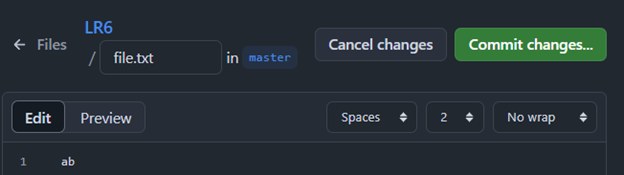

**после чего подтянем его в локальный репозиторий:**

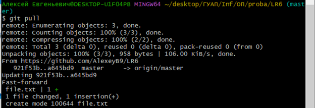
### 2) Просмотрим историю изменений:
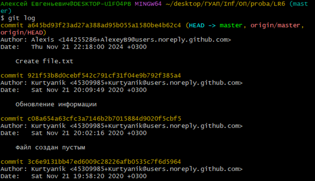
### 3) Посмотрим ветки:
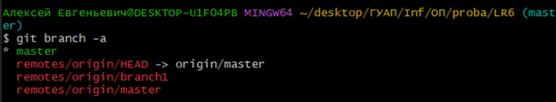
### 4) Производим слияние веток:
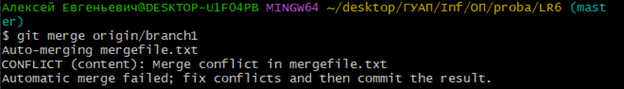
### 5) Устраняем конфликт и удаляем ветку:
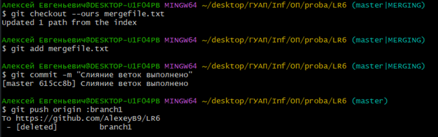
### 6) Изменяем файл:
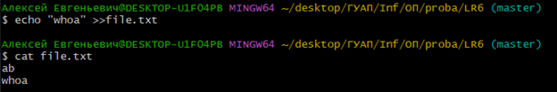

**Делаем коммит:**

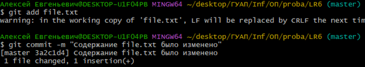
### 7) Откатываем коммит:
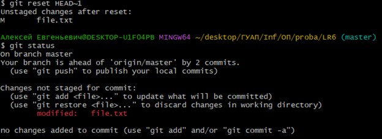

**откатываем также и файл:**


### 8) Переходим к оформлению README для этого создаю папку которая будет хранить фото работы и сохраняю изменения:
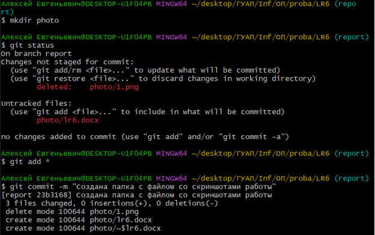

## Лог команд:
```
cd ... (смена текущей директории)
git clone ... (клонирование репозитория для локальной работы)
git pull (подтягивание изменений с гитхаба)
git log --all (просмотр истории изменений)
git branch -a (просмотр всех веток)
git merge origin/branch1 (автоматическое слияние веток)
git checkout --ours mergefile.txt (выбор текущей ветки как основной для определенного файла(в нашем случае это mergefile.txt))
git add mergefile.txt (добавление измененных файлов в следующий коммит)
git commit -m "..." (создание коммита с комментарием)
git push origin :branch1 (пуш изменений без ветки branch1)
echo "..." >>file.txt (запись данных в файл)
cat file.txt (просмотр содержимого файла)
git reset HEAD~1 (откат коммита назад на 1)
git status (просмотр состояния файлов в ветке(есть ли изменения))
git checkout -- file.txt (откат файла на 1 версию назад)
mkdir photo (создание директории)
```
## История операций в отформатированном виде:
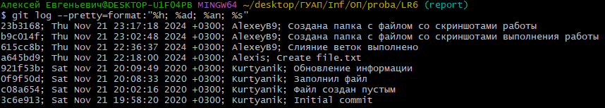
## Демонстрация оформления отчёта в README
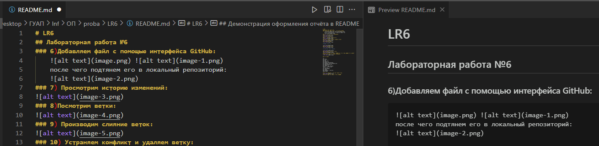