# LR6
## Лабораторная работа №6
### 6)Добавляем файл с помощью интерфейса GitHub:
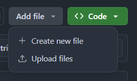
после чего подтянем его в локальный репозиторий:
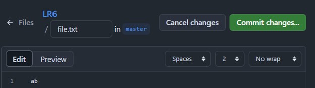
### 7) Просмотрим историю изменений:
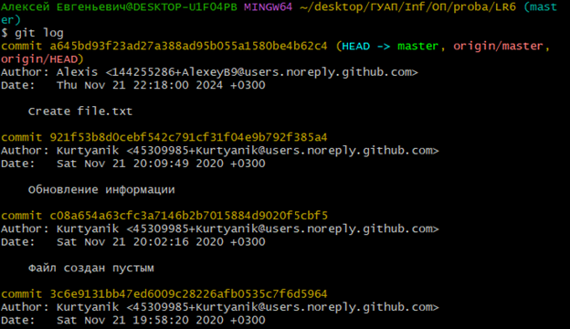
### 8)Посмотрим ветки:
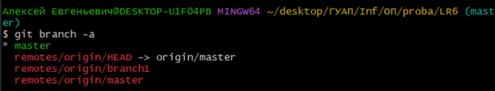
### 9) Производим слияние веток:
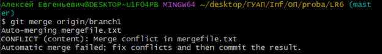
### 10) Устраняем конфликт и удаляем ветку:
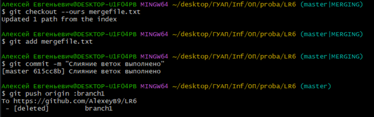
### 11)Изменяем файл:
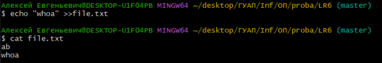

**Делаем коммит:**

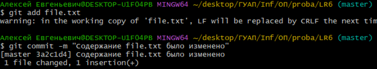
### 12)Откатываем коммит:
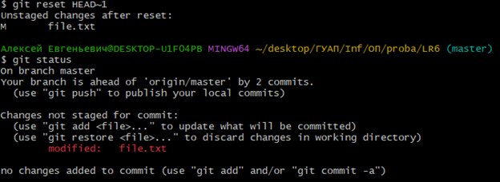

**откатываем также и файл:**

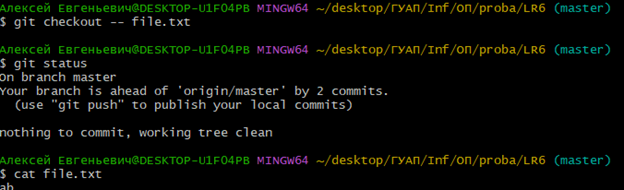
### 13)Создаем ветку для отчёта:

### 14)Переходим к оформлению README для этого создаю папку которая будет хранить фото работы и сохраняю изменения:
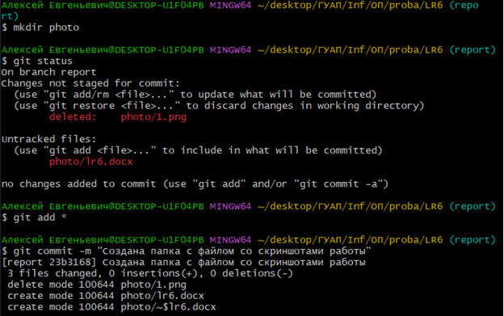

## Лог команд:
```
cd ...
git clone ...
git pull
git log --all
git branch -a
git merge origin/branch1
git checkout --ours mergefile.txt
git add mergefile.txt
git commit -m "..."
git push origin :branch1
echo "..." >>file.txt
cat file.txt
git reset HEAD~1
git status
git checkout -- file.txt
mkdir photo
```
## История операций в отформатированном виде:
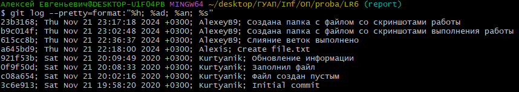
## Демонстрация оформления отчёта в README
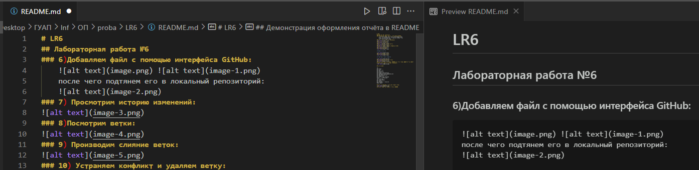